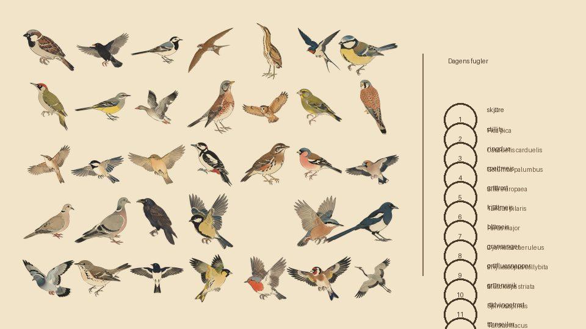
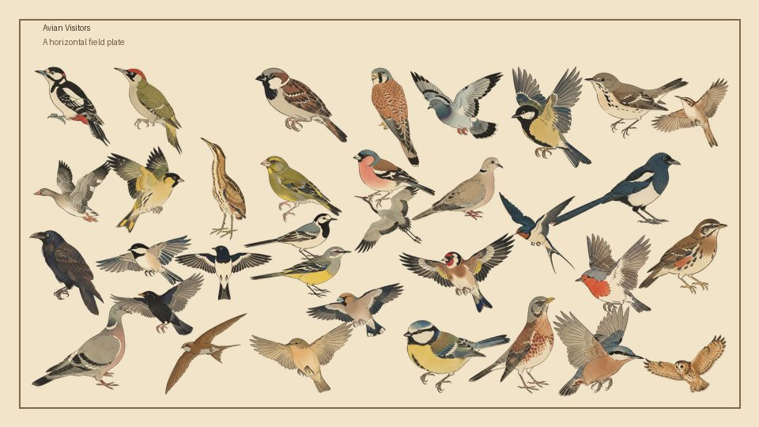
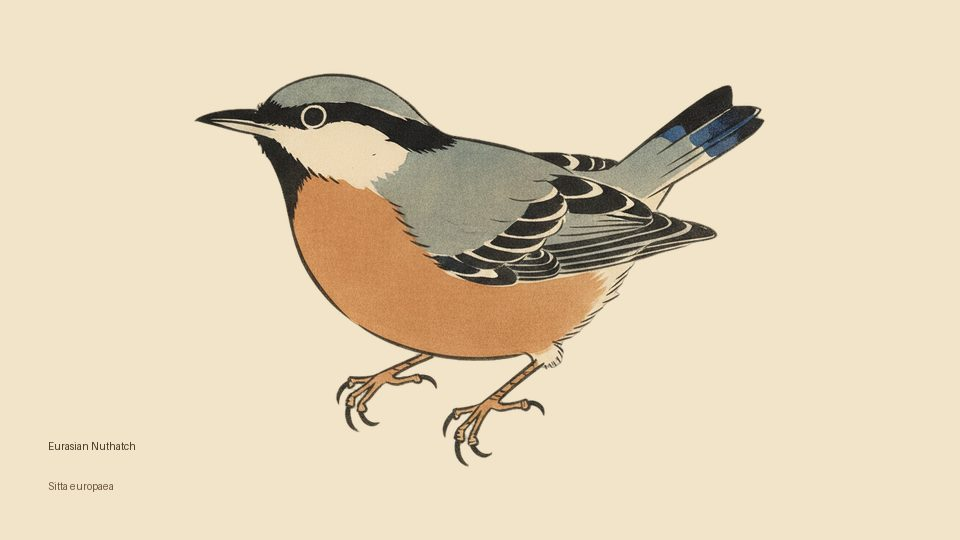
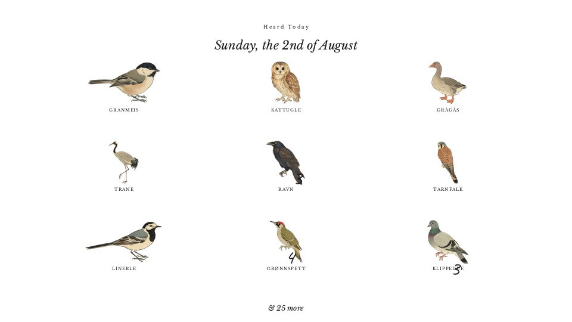
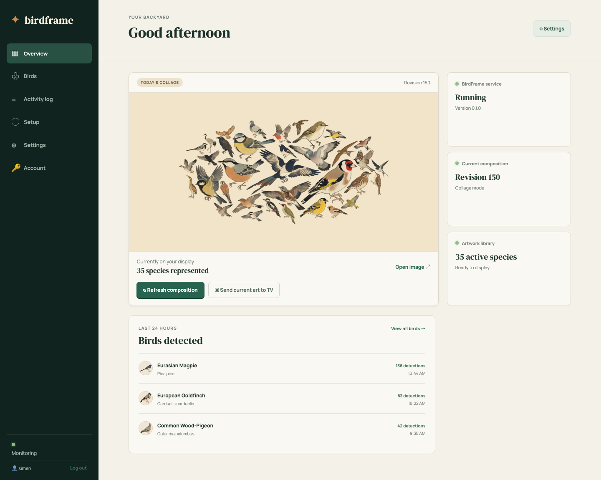
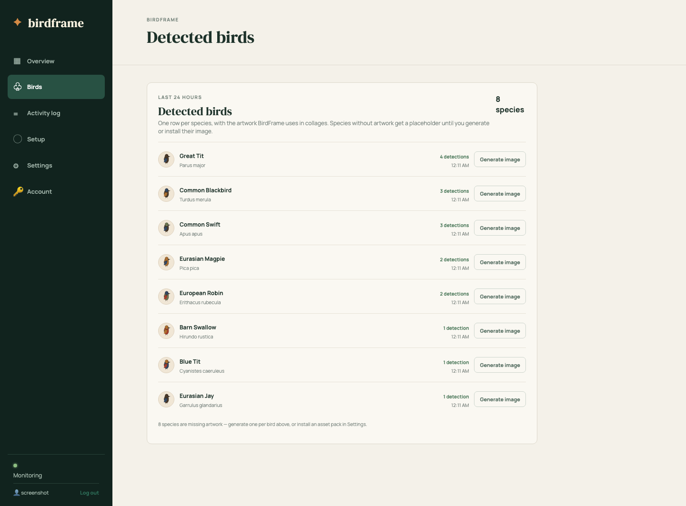
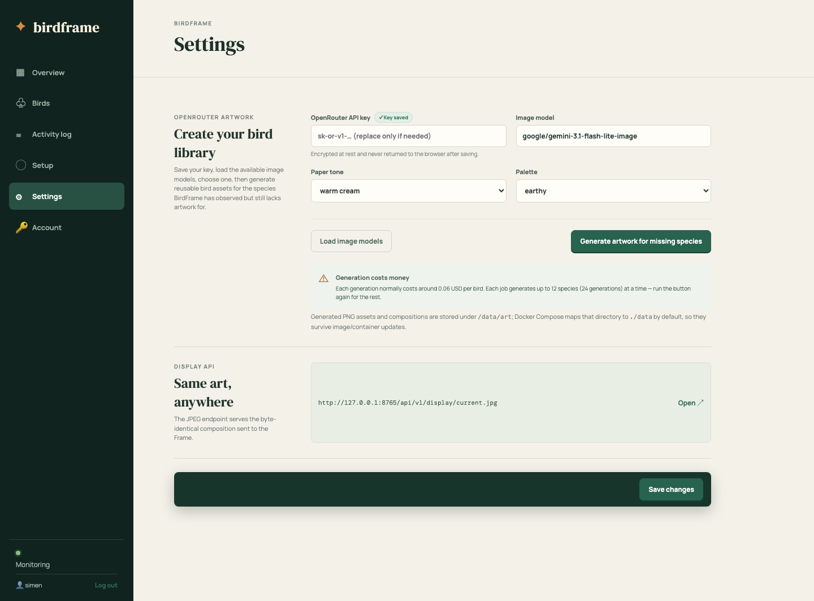
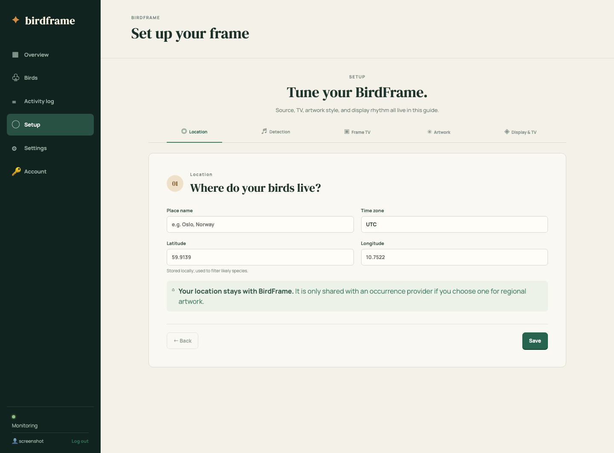

# BirdFrame

BirdFrame is a self-hosted, non-commercial bird visitor display for Samsung The
Frame TVs. It listens for birds through
[BirdNET-Go](https://github.com/tphakala/birdnet-go) or an existing
[BirdWeather](https://www.birdweather.com) station, assembles an evolving 16:9
field-guide collage from transparent bird illustrations, and pushes the exact
same JPEG to your Frame — and to any other display — automatically.

The collage style is inspired by
[AvianVisitors](https://github.com/Twarner491/AvianVisitors), a beautiful
mask-aware, landscape packing project for Frame displays. BirdFrame reimplements
that layout idea with its own compositor, typography, and artwork packs — a big
thank you to the AvianVisitors project for the inspiration. The **Field
Journal** display mode additionally re-implements the journal-page layout from
[willmanidis2's frame-journal-layout fork](https://github.com/willmanidis2/AvianVisitors/tree/feat/frame-journal-layout)
— a longhand date, a three-column grid of the day's species, and each count
written in handwriting at the bird's lower right. BirdFrame does not include
AvianVisitors code or artwork; see
[THIRD_PARTY_NOTICES.md](THIRD_PARTY_NOTICES.md) for attribution details,
including the bundled OFL fonts (Caveat and Libre Baskerville).

## Four ways to see your backyard

| Living collage | Field plate |
| --- | --- |
|  |  |
| Latest visitor | Field journal |
|  |  |

Pick a layout in Settings or the setup guide. The Field journal is the
quietest of the four: a longhand date, a three-column grid of the day's
species, and each bird's count written in handwriting at its lower right.

## Screenshots



| Birds — one row per species, with artwork status and one-click generation | Settings — artwork, asset packs, and the display API |
| --- | --- |
|  |  |

The [setup guide](docs/setup.md) walks through location, detection source, TV,
artwork style, and display rhythm — and stays available after first run for
quick adjustments.



## Quick start

Requirements: a 64-bit Linux machine (AMD64 or ARM64) with Docker Engine and a
browser on the same LAN. A Samsung TV is only needed for direct TV control;
Docker Desktop works for BirdWeather mode but is not a supported
local-microphone or LAN-discovery host.

Run the published multi-architecture image — no clone or build required:

```sh
mkdir -p data
docker run -d --name birdframe --restart unless-stopped \
  -p 8765:8765 \
  -v "$PWD/data:/data" \
  -e TZ=Europe/Oslo \
  ghcr.io/simenf/birdframe:latest
```

Open `http://HOSTNAME-OR-IP:8765` and complete the setup wizard. The default
starts only BirdFrame, for use with public BirdWeather data or prepared artwork.
A private BirdWeather token is optional.

Prefer to build from source (for development or customization)? Use Docker
Compose:

```sh
git clone https://github.com/simenf/birdframe.git
cd birdframe
cp .env.example .env
mkdir -p data birdnet-go-data
docker compose up -d
```

The first visitor creates the administrator account; every later visitor signs
in with a username and password. The web UI uses an API key tied to your
account, and every management API call requires one. Generate and revoke keys
under Settings → API keys and users, and add additional users from the same
panel (admin only).

For a USB/local microphone on Linux, start the optional upstream sidecar:

```sh
docker compose --profile local-audio up -d
```

The container receives `/dev/snd`; select and test its microphone in the
BirdNET-Go administration page linked from BirdFrame. See
[docs/installation.md](docs/installation.md) before deploying permanently.

## Install the asset packs

Once the service is running, the quickest way to get beautiful artwork is the
official BirdFrame asset catalog — no source build or manual downloads needed:

1. Open **Settings → Asset Packs**.
2. Set the **Catalog URL** to:

   ```text
   https://avianassets.simenf.com/catalog.json
   ```

3. Click **Save catalog URL**, then **Load catalog packages**.
4. Pick a regional pack and click **Install**. The catalog currently ships
   Germany, Switzerland, and Western US packs, each with hundreds of full-color
   illustrations plus pencil sketches.

The catalog is hosted on Cloudflare R2 (zero egress fees) and is the maintained
way to fetch assets after installation. The image intentionally ships without
artwork to stay small. You can also install from any other compatible HTTPS
catalog, or drop ZIPs into the persistent `data/art/packages` directory — see
[docs/artwork.md](docs/artwork.md). Always review a pack's manifest, license,
and attribution before use.

## What is sent where

- Audio stays in BirdNET-Go on your host. BirdFrame does not send microphone
  audio to OpenRouter.
- Public BirdWeather mode reads public detections using a station ID (for
  example `2505`) and needs no credential. Private-station mode asks
  BirdWeather only for the detections authorized by your token.
- Artwork generation sends text prompts and only the references you explicitly
  select to your chosen OpenRouter model/provider.
- Samsung control and image upload occur over your local network.

## Persistent artwork and logs

Docker Compose bind-mounts `${BIRDFRAME_DATA_DIR:-./data}` to `/data` in the
container. Generated species PNGs, installed packages, rendered JPEGs, the
SQLite database, encrypted secrets, and the in-app activity log therefore
survive image rebuilds and container replacement. Back up the host `./data`
directory before moving an installation. Composition history is pruned to one
JPEG per day for the past year, and the activity log is kept for 30 days, so
long-running installations do not grow without bound.

## Generic display API

The composition does not depend on the Samsung integration. Other devices can
display the exact JPEG selected for TV upload:

```text
GET /api/v1/display/current.jpg
GET /api/v1/display/current.json
GET /api/v1/display/events
```

Read [docs/display-api.md](docs/display-api.md) for caching, authentication,
and embedding examples.

## Operations

```sh
# Check service state and recent logs
docker compose ps
docker compose logs --tail=100 birdframe

# Upgrade after updating BIRDFRAME_VERSION in .env
docker compose pull
docker compose up -d

# Stop without removing persistent data
docker compose down
```

Back up the `data/` directory while the service is stopped. It contains the
database, encryption key, TV token, settings, artwork, and display artifacts.
Do not lose `data/secret.key`: encrypted tokens cannot be recovered without it.

## Documentation

- [Installation and upgrades](docs/installation.md)
- [Setup wizard](docs/setup.md)
- [Microphone and BirdNET-Go](docs/microphone.md)
- [BirdWeather](docs/birdweather.md)
- [Samsung Frame](docs/samsung-frame.md)
- [Display API](docs/display-api.md)
- [Artwork and packages](docs/artwork.md)
- [Asset-pack authoring guide](docs/asset-packs.md)
- [Localization and Norwegian names](docs/localization.md)
- [Troubleshooting](docs/troubleshooting.md)
- [Development](docs/development.md)

## Publishing and licensing

The repository is ready to build from a clean checkout, but a release
maintainer still needs to choose a GitHub owner, publish a container image, and
review each optional artwork/model license. Source code and original
documentation are CC BY-NC-SA 4.0; see [LICENSE](LICENSE) and
[THIRD_PARTY_NOTICES.md](THIRD_PARTY_NOTICES.md). Local runtime state is ignored
by Git and must never be committed.
