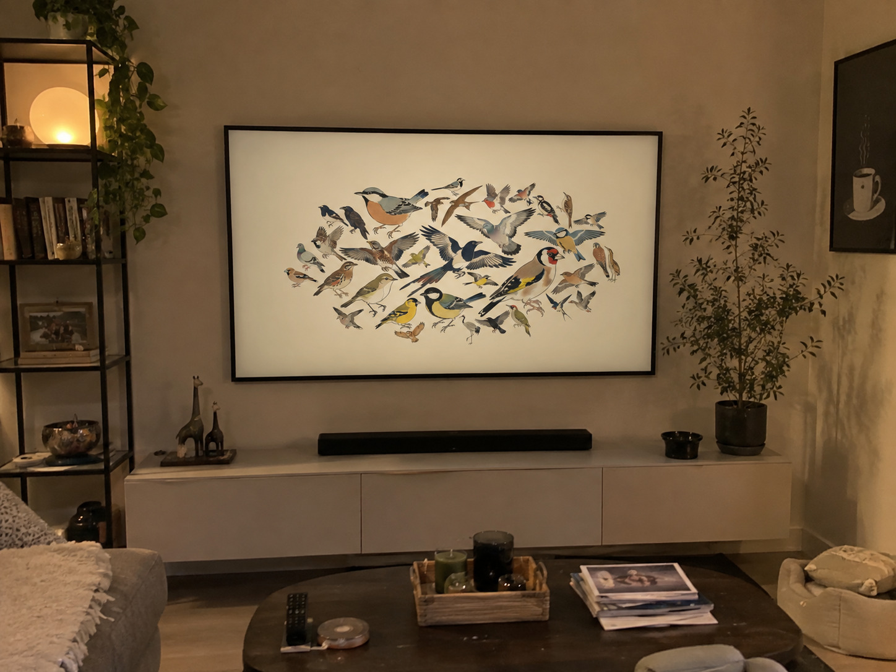
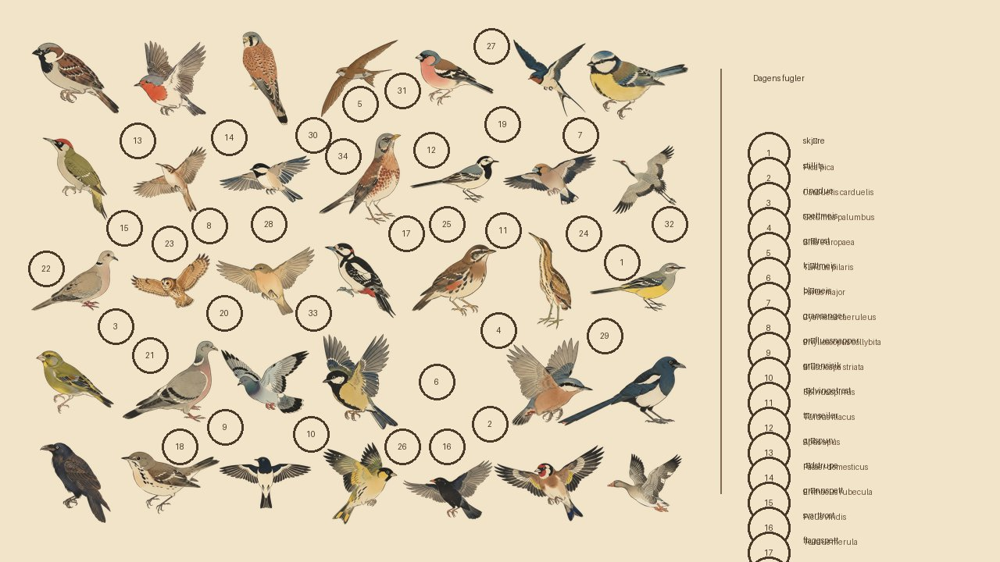
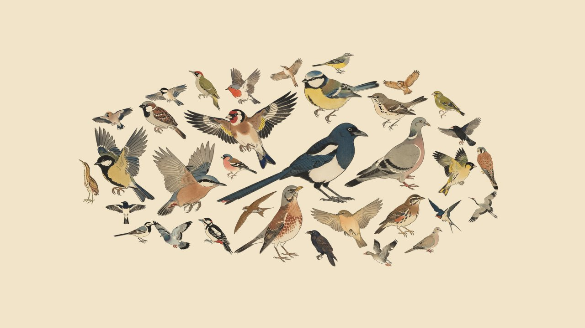
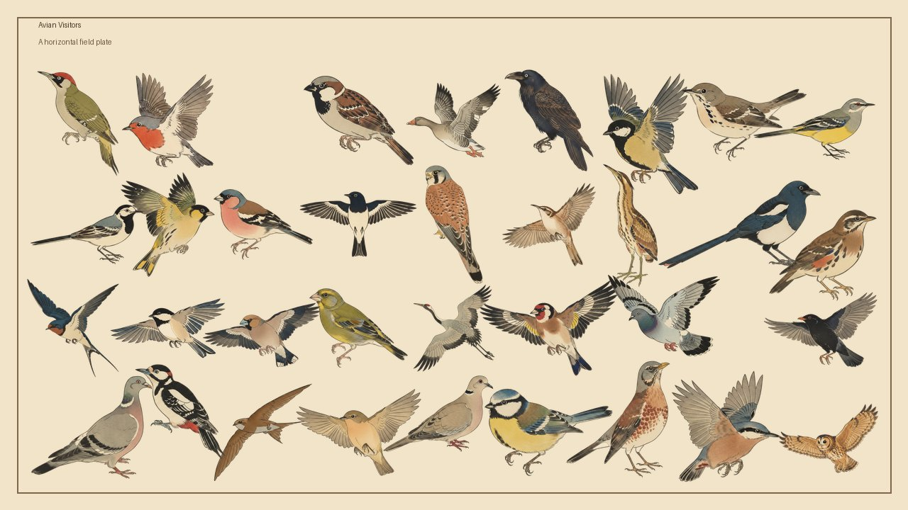
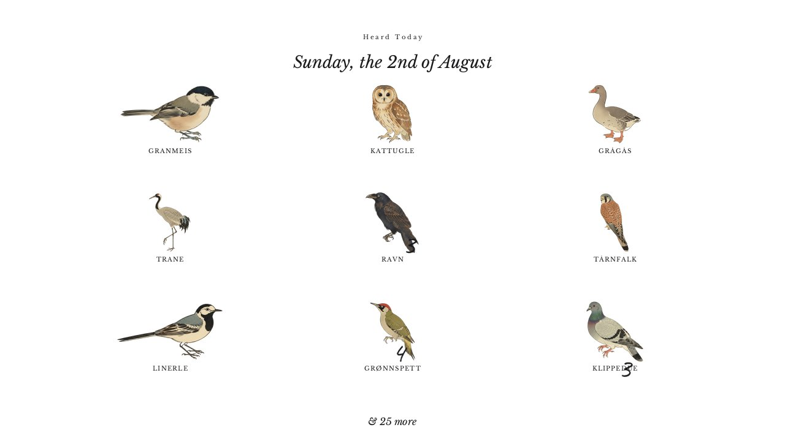
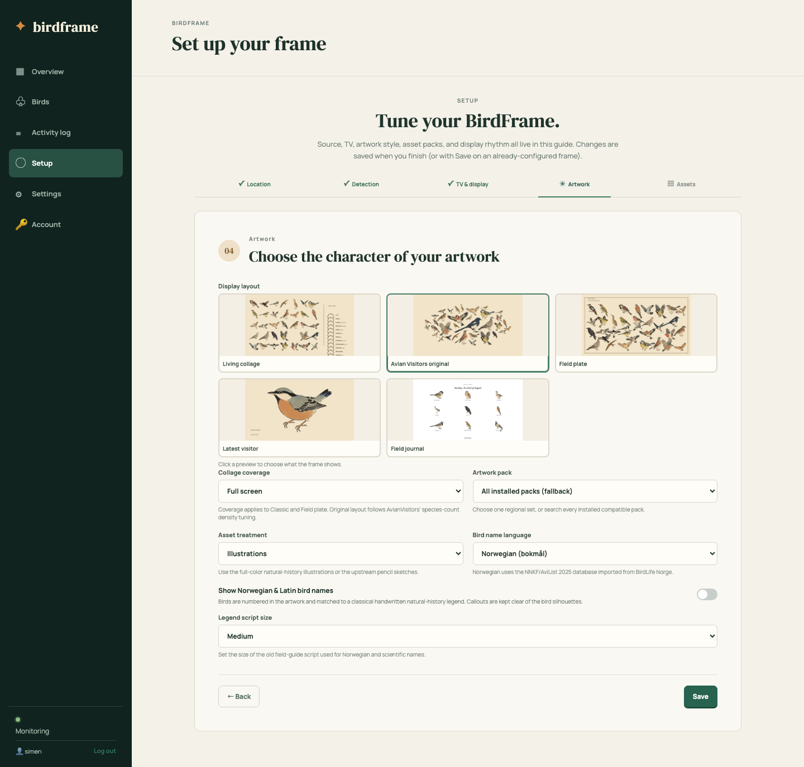

# BirdFrame

BirdFrame is a self-hosted, bird visitor display for Samsung The
Frame TVs. It listens for birds through
[BirdNET-Go](https://github.com/tphakala/birdnet-go) or an existing
[BirdWeather](https://www.birdweather.com) station, and creates beatiful artwork for your samsung frame tv based on the birds in your back yard.

It is based on the ideas of [Avianvisitors](https://github.com/Twarner491/AvianVisitors) which is the same concept, but for e-ink displays. The frame journal view is based on [willmanidis2's frame-journal-layout fork](https://github.com/willmanidis2/AvianVisitors/tree/feat/frame-journal-layout)

## Android bird detection

The new [BirdFrame Bird Provider](https://github.com/simenf/birdframe-birdprovider)
app performs bird detection on an Android device and supports the
[BirdNET-Go API](https://github.com/tphakala/birdnet-go), so it can provide
bird detections directly to BirdFrame.

 

BirdFrame can draw your backyard in five ways.

| Living collage | Avian Visitors original | Field plate |
| --- | --- | --- |
|  |  |  |
| Latest visitor | Field journal | |
|  |  | |


[THIRD_PARTY_NOTICES.md](THIRD_PARTY_NOTICES.md)

## The app


| Birds — one row per species, with artwork status and one-click generation | Settings — artwork generation and the display API |
| --- | --- |
|  |  |

The [setup guide](docs/setup.md) walks through location, detection source, TV,
artwork style, asset packs, and display updates.



## Quick start

Requirements: a 64-bit Linux machine (AMD64 or ARM64) with Docker Engine and a
browser on the same LAN. A Samsung TV is only needed for direct TV control;
Docker Desktop works for BirdWeather mode but is not a supported
local-microphone or LAN-discovery host.

Run the published multi-architecture image — no clone or build required:

```sh
mkdir -p data
docker run -d --name birdframe --restart unless-stopped \
  -p 8765:8765 \
  -v "$PWD/data:/data" \
  -e TZ=Europe/Oslo \
  ghcr.io/simenf/birdframe:latest
```

Open `http://HOSTNAME-OR-IP:8765` create a user and complete the setup wizard. The default
starts only BirdFrame.

Prefer to build from source (for development or customization)? Use Docker
Compose:

```sh
git clone https://github.com/simenf/birdframe.git
cd birdframe
cp .env.example .env
mkdir -p data birdnet-go-data
docker compose up -d
```

The first visitor creates the administrator account; every later visitor signs
in with a username and password. 


## Install the asset packs

Once the service is running, the quickest way to get beautiful artwork is to add an openrouter api key and generate images, or through the
official BirdFrame asset catalog — no source build or manual downloads needed:

1. Open **Settings → Asset Packs**.
2. Set the **Catalog URL** to:

   ```text
   https://avianassets.simenf.com/catalog.json
   ```

3. Click **Save catalog URL**, then **Load catalog packages**.
4. Pick a regional pack and click **Install**. The catalog currently ships
   Germany, Switzerland, and Western US packs, each with hundreds of full-color
   illustrations plus pencil sketches.

You can also install from any other compatible HTTPS
catalog, or drop ZIPs into the persistent `data/art/packages` directory — see
[docs/artwork.md](docs/artwork.md).


## Persistent artwork and logs

Docker Compose bind-mounts `${BIRDFRAME_DATA_DIR:-./data}` to `/data` in the
container. Generated species PNGs, installed packages, rendered JPEGs, the
SQLite database, encrypted secrets, and the in-app activity log therefore
survive image rebuilds and container replacement. Back up the host `./data`
directory before moving an installation. Composition history is pruned to one
JPEG per day for the past year, and the activity log is kept for 30 days, so
long-running installations do not grow without bound.

## Generic display API


```text
GET /api/v1/display/current.jpg
GET /api/v1/display/current.json
GET /api/v1/display/events
```

Read [docs/display-api.md](docs/display-api.md) for caching, authentication,
and embedding examples.

## Operations

```sh
# Check service state and recent logs
docker compose ps
docker compose logs --tail=100 birdframe

# Upgrade after updating BIRDFRAME_VERSION in .env
docker compose pull
docker compose up -d

# Stop without removing persistent data
docker compose down
```

Back up the `data/` directory while the service is stopped. It contains the
database, encryption key, TV token, settings, artwork, and display artifacts.
Do not lose `data/secret.key`: encrypted tokens cannot be recovered without it.

## Documentation

- [Installation and upgrades](docs/installation.md)
- [Setup wizard](docs/setup.md)
- [Microphone and BirdNET-Go](docs/microphone.md)
- [BirdWeather](docs/birdweather.md)
- [Samsung Frame](docs/samsung-frame.md)
- [Display API](docs/display-api.md)
- [Artwork and packages](docs/artwork.md)
- [Asset-pack authoring guide](docs/asset-packs.md)
- [Localization and Norwegian names](docs/localization.md)
- [Troubleshooting](docs/troubleshooting.md)
- [Development](docs/development.md)

## Publishing and licensing
Source code and original
documentation are CC BY-NC-SA 4.0; see [LICENSE](LICENSE) and
[THIRD_PARTY_NOTICES.md](THIRD_PARTY_NOTICES.md).

## Notes on AI
This is almost entirely created using CODEX with GPT 5.6 Luna, and Codex with Deepseek V4 flash 0731. In total around 1 quota of chagpt plus and around 120 million deepseek tokens. Also, I know nothing about birds, computers, the internet or security. I have asked AI if this is secure and it thinks it is. 
